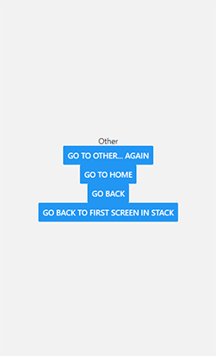

# Instalação

```powershell
npx create-expo-app nome_projeto --template
> Blank (Typescript)
cd nome_projeto

# crie uma pasta:
mkdir src
cd src
mkdir screens
mkdir Other
```

package.json

```json
{
	"name": "segundo_app",
	"version": "1.0.0",
	"main": "node_modules/expo/AppEntry.js",
	"scripts": {
		"start": "expo start --port 9999",
		"android": "expo start --android --port 9999",
		"ios": "expo start --ios --port 9999",
		"web": "expo start --web --port 80"
	},
	"dependencies": {
		"@expo-google-fonts/inter": "^0.2.3",
		"@expo-google-fonts/lato": "^0.2.3",
		"@expo-google-fonts/roboto": "^0.2.3",
		"@expo/webpack-config": "^18.0.1",
		"@react-navigation/native": "^6.1.7",
		"@react-navigation/native-stack": "^6.9.13",
		"@types/react": "~18.0.27",
		"@types/styled-components-react-native": "^5.2.1",
		"expo": "^48.0.19",
		"expo-app-loading": "^2.1.1",
		"expo-asset": "~8.9.1",
		"expo-file-system": "~15.2.2",
		"expo-font": "~11.1.1",
		"expo-linear-gradient": "~12.1.2",
		"expo-notifications": "~0.18.1",
		"expo-sqlite": "~11.1.1",
		"react": "18.2.0",
		"react-dom": "18.2.0",
		"react-native": "0.71.3",
		"react-native-asset": "^2.0.1",
		"react-native-base64": "^0.2.1",
		"react-native-dialog": "^9.2.2",
		"react-native-gifted-charts": "1.2.41",
		"react-native-responsive-fontsize": "^0.5.1",
		"react-native-safe-area-context": "4.5.0",
		"react-native-screens": "~3.20.0",
		"react-native-svg": "13.4.0",
		"react-native-web": "~0.18.11",
		"react-native-webview": "11.26.0",
		"styled-components": "^5.3.5"
	},
	"devDependencies": {
		"@babel/core": "^7.20.0",
		"sharp-cli": "^4.1.1",
		"typescript": "^4.9.4"
	},
	"private": true
}
```

babel.config.js

```js
module.exports = function (api) {
	api.cache(true);
	return {
		presets: ['babel-preset-expo']
	};
};
```

App.tsx

```tsx
import * as React from 'react';
import { Button, View, Text } from 'react-native';
import { NavigationContainer } from '@react-navigation/native';
import { createNativeStackNavigator } from '@react-navigation/native-stack';
import Home from './src/screens/Home';
import Other from './src/screens/Other';

const Stack = createNativeStackNavigator();

function App() {
	return (
		<NavigationContainer>
			{/**/}
			{/* screenOptions={{ headerShown: false }} ➜ esconde todos Headers */}
			{/**/}
			<Stack.Navigator screenOptions={{ headerShown: false }}>
				{/**/}
				{/* options={{ headerShown: false }} ➜ esconde o Header da página */}
				{/* options={{ headerLeft/headerTitle/headerRight: () => (<Button />) }} ➜ Dá pra colocar componentes no Header */}
				{/**/}
				<Stack.Screen
					name="Home"
					component={Home}
					options={{ title: 'Home' }}
				/>
				<Stack.Screen
					name="Other"
					component={Other}
					options={{ title: 'Other' }}
				/>
			</Stack.Navigator>
		</NavigationContainer>
	);
}

export default App;
```

src/screens/Home/index.tsx

```tsx
import * as React from 'react';
import { Box, BoxText } from './styles';
import { Button, View, Text } from 'react-native';

const Home = ({ navigation }: { navigation: any }) => {
	return (
		<Box>
			<Text>Home Screen</Text>
			<Button
				title="Go to Details"
				onPress={() => navigation.navigate('Other')}
			/>
			<BoxText>teste</BoxText>
		</Box>
	);
};
export default Home;
```

src/screens/Home/styles.tsx

```tsx
import styled from 'styled-components/native';

export const Box = styled.View`
	flex: none;
	width: 100%;
	height: 100%;
	justify-content: center;
	align-items: center;
`;
export const BoxText = styled.Text``;
```

src/screens/Home/index.tsx

```tsx
import * as React from 'react';
import { Button, View, Text } from 'react-native';

const Other = ({ navigation }: { navigation: any }) => {
	return (
		<View
			style={{ flex: 1, alignItems: 'center', justifyContent: 'center' }}
		>
			<Text>Other</Text>
			<Button
				title="Go to Other... again"
				onPress={() => navigation.push('Other')}
			/>
			<Button
				title="Go to Home"
				onPress={() => navigation.navigate('Home')}
			/>
			<Button title="Go back" onPress={() => navigation.goBack()} />
			<Button
				title="Go back to first screen in stack"
				onPress={() => navigation.popToTop()}
			/>
		</View>
	);
};
export default Other;
```
